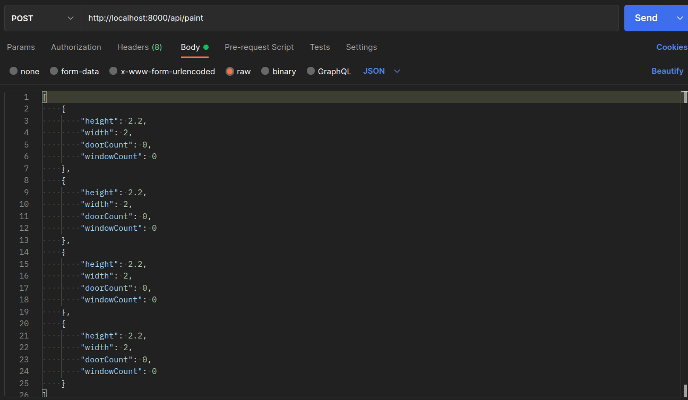
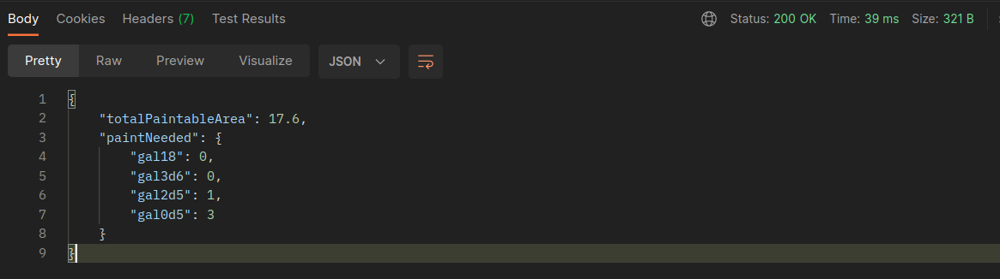

# Roompaint Calc

Trata-se de uma aplicação que ajuda o usuário a calcular a quantidade de tinta necessária para pintar uma sala.

O usuário informa as medidas de cada parede da sala, bem como a quantidade de portas e janelas cada parede tem, e a aplicação traz como resultado a quantidade de latas de tinta de cada tamanho que são necessárias para a pintura.

Os tamanhos de latas de tinta são:

- 18 L
- 3,6 L
- 2,5 L
- 0,5 L

## Como rodar a aplicação localmente

1. Clone o repositório utilizando `git clone`

2. Instale as dependências
- `npm install`

3. Opcionalmente, crie na raiz da aplicação um arquivo '.env' para definir a variável de ambiente da porta a ser utilizada, por exemplo:
- `PORT=8000`

4. Rode a aplicação
- `npm start`

5. Para executar os testes
- `npm test`

## O que foi desenvolvido

Aplicação Node/Express utilizando a arquitetura MVC, com os seguintes endpoints:

- POST /api/paint

  - Recebe uma requisição do tipo POST contendo um body do tipo JSON, que deve ser um array de objetos, sendo que cada objeto representa uma parede, com suas respectivas medidas e quantidade de portas e janelas:
    
  - O endpoint retorna um objeto JSON com a área útil total a ser pintada, bem como com a quantidade de latas de cada tamanho que serão necessárias:
    

- GET /
  - Renderiza uma interface SSR (server-side rendered), a qual disponibiliza um formulário para o usuário digitar os dados de cada uma das 4 paredes da sala a ser pintada. Quando o usuário submete o formulário, é feita uma requisição POST para o endpoint `/api/paint`, acima descrito, e o resultado é renderizado na tela para o usuário.

## Regras de negócio

1. Nenhuma parede pode ter menos de 1 metro nem mais de 15 metros, mas podem possuir alturas e larguras diferentes
2. O total de área das portas e janelas deve ser no máximo 50% da área de parede
3. A altura de paredes com porta deve ser, no mínimo, 30 centímetros maior que a altura da porta
4. Cada janela possui as medidas: 2,00 x 1,20 mtos
5. Cada porta possui as medidas: 0,80 x 1,90
6. Cada litro de tinta é capaz de pintar 5 metros quadrados
7. Não considerar teto nem piso.
8. As variações de tamanho das latas de tinta são:

- 0,5 L
- 2,5 L
- 3,6 L
- 18 L
